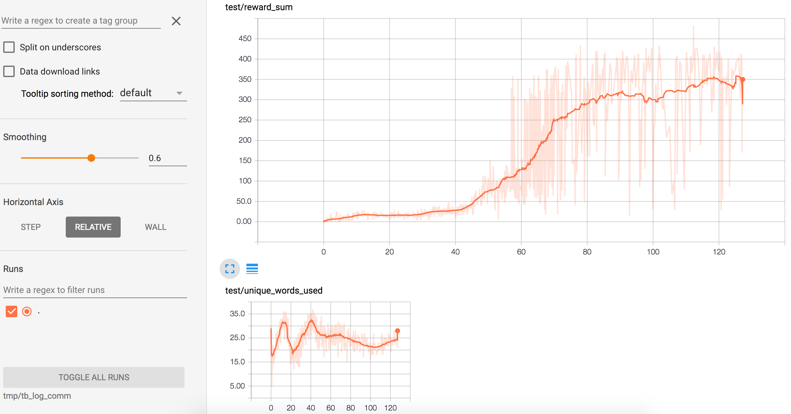
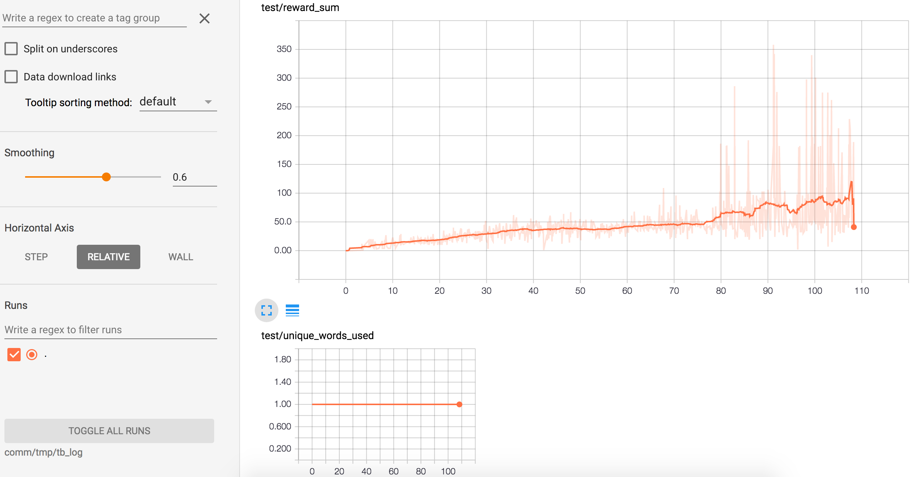

# Split Screen Communication Learning

This is a PyTorch demonstration of split-screen communication learning.

Read the description below & then view the model in action at: https://www.youtube.com/watch?v=f0Wex0IeFNM&t=43s

# Description of setup
In this Screen Splitting approach, one splits up the observation (and possibly the action controls) so that agent(s) performing action(s) do not have complete access to the entire observation. One then sets up a communication channel between agents (each with different portions of the observation) so that agent(s) with part of the observation and agent(s) with the access to the main action control (e.g. moving the paddle in Breakout) are forced to learn to communicate with discrete words in order to successfully complete a task.

To verify this approach, a model/environment was implemented in which agents successfully learned to communicate to obtain an average reward of 320 per episode (and cleared the whole screen (obtained reward per episode higher than 432) at least once) in a partially observable version of BreakoutDeterministic-v4 in which the screen is split with a horizontal line such that one agent with no non-linguistic action control sees the top 93% of the screen and another agent with access to the paddle controls sees the bottom 4% of the screen (just the paddle and below).

This partially observable environment is unsolvable unless the agents learn a communication policy. To check this, I ran a baseline with a blocked communication channel that only obtained an average reward of 90 (2/7 that of the same model with communication enabled with the same amount of training).
 

# Description of Model I created that solves this setup's task
The model is similar to COMA from Foerster et al. 2017 [arXiv:1705.08926] and MADDPG from [arXiv:1706.02275] in that it uses an omniscient critic (that sees combination of all agent's observations & actions) during training to stabilize the training of agents whose policies only have access to partial observations of the environment at test time.

Each agent is an A3C with GAE using an architecture consisting of (4 layer conv for embedding percepts & linear layer for embedding communicated messages) -> lstm -> separate linear heads for generating communications & actions. The omniscient critic is 4 layer conv -> lstm -> linear layer to estimate value of actions. The communication channel between agents is differentiable like in RIAL from [arxiv:1605.06676], but uses a categorical & more accurate estimator from "Lost Relatives of the Gumbel Trick" [arxiv:1706.04161] that averages N gumbel distributions and subtracts out Euler's constant. The linear layers of the communication message embedding & generation (decoding) layers are tied due to accuracy & speed gains as described in [arxiv:1611.01462].

## Long Term Plan
Once meta/transfer learning & catastrophic forgetting (and some other unsolved problems) are solved by ml research commnunity, train (and record rollouts from) this setup in a large number of environments. Then record rollouts of humans acting & communicating (with just other humans) in this environment, and use these separate bot & human rollouts to train Semantic Belief Translators (or some other translator that doesn't require aligned corpora such as [CycleGAN](https://github.com/junyanz/CycleGAN)) (so that bots' invented language will be translated to English) as outlined in Jacob Andreas' "Translating Neuralese" https://arxiv.org/abs/1704.06960

## Usage

To view trained communication model running:
```
OMP_NUM_THREADS=1 python3 main.py --env_name "BreakoutDeterministic-v4" --num_processes 0 --max_vocab_size 40 --dirichlet_vocab False --load True --load_file "model_comm" --save False --demonstrate True --max_episode_length 3000
```
^Note: you will see the whole screen rendered; but agent with controls only sees portion of screen from paddle to bottom of screen, and other agent with no controls (other than sending a single discrete integer msg per timestep) only sees portion of screen above the paddle.

to view tensorboard of trained communication model:
tensorboard --logdir tmp/tb_log_comm --port 6006


To view baseline with disabled communication running:
```
OMP_NUM_THREADS=1 python3 main.py --env_name "BreakoutDeterministic-v4" --num_processes 0 --max_vocab_size 1 --dirichlet_vocab False --load True --load_file "model_no_comm" --save False --demonstrate True --max_episode_length 3000
```

to view tensorboard of baseline with disabled communication:
tensorboard --logdir tmp/tb_log_no_comm_baseline --port 6007


To train your own communication model:
```
sudo OMP_NUM_THREADS=1 nohup python3 main.py --env_name "BreakoutDeterministic-v4" --num_processes 63 --max_vocab_size 40 --dirichlet_vocab False --save True > /dev/null 2>&1&
```


Note:
Install version '0.1.12+49ec984' of PyTorch via this command: 
`
pip3 install git+https://github.com/pytorch/pytorch@49ec984c406e67107aae2891d24c8839b7dc7c33
` 
I can't guarantee the same performance in other versions of pytorch.

If you want to use aws, the ami of the image used is ami-c77752d1 with name "new-brodcast-pt-new-gym-sk-image"

## Results

With 63 processes with communication enabled it obtains average reward per episode of 320 (3.5 times that of baseline with disabled communication) for BreakoutDeterministic-v4 after 108 hours of training on aws m4.16xlarge cpu instance.

Comm Enabled


Comm Disabled (Baseline)


###### Acknowledgements
- [@ikostrikov](https://github.com/ikostrikov)'s [pytorch-a3c](https://github.com/ikostrikov/pytorch-a3c)
- [@pfnet](https://github.com/pfnet)'s [ChainerRL](https://github.com/pfnet/chainerrl)
